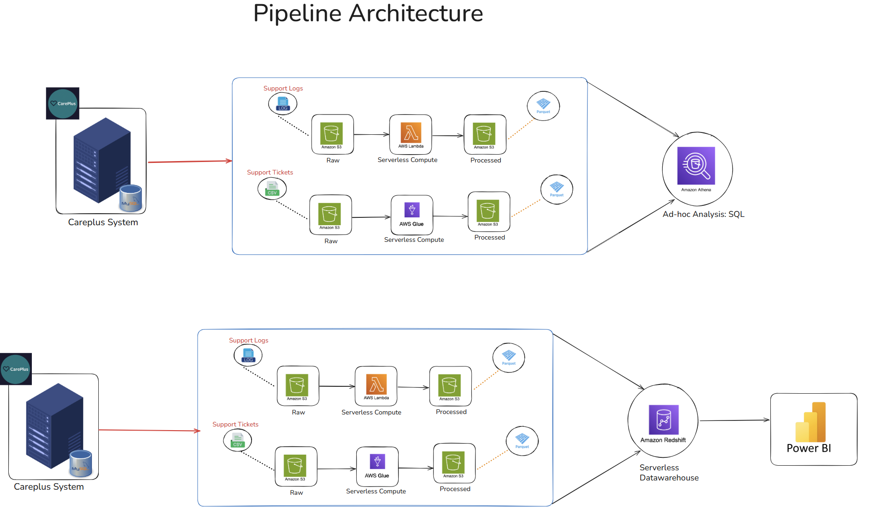

# 🏥 CarePlus Support Analytics — AWS End-to-End ETL Pipeline

## 📌 Project Overview

An end-to-end ETL pipeline built on AWS for CarePlus, a healthcare support system that captures both structured support ticket data and unstructured system log data.

The pipeline ingests raw data from two distinct sources into Amazon S3, applies source-specific transformations using AWS Lambda (logs) and AWS Glue (tickets), enables ad-hoc SQL analysis via Amazon Athena, and loads curated data into Amazon Redshift for downstream reporting in Power BI.

---

## 🏗️ Architecture

```text
CarePlus System
      │
      ├── MySQL (Support Tickets → CSV)
      └── Log Files (System/Error Logs → .log)
              │
              ▼ Extract
        Data Lake — Amazon S3
              │
      ┌───────┴────────┐
      │                │
  Log Files         CSV Files
  (unstructured)    (structured)
      │                │
  AWS Lambda       AWS Glue
  (serverless)     (serverless)
      │                │
      └───────┬────────┘
              ▼ Parquet
        S3 Processed Layer
              │
        ┌─────┴──────┐
        │            │
   Amazon Athena   Amazon Redshift
   (Ad-hoc SQL)   (Data Warehouse)
                       │
                   Power BI
               (Dashboards & Analytics)
```

### Full Architecture Diagrams




---

## 📦 Tech Stack

| Purpose | Technology |
| --- | --- |
| **Source System** | MySQL (tickets), Log files (system errors) |
| **Raw Storage** | Amazon S3 (Data Lake — Raw layer) |
| **Log Processing** | AWS Lambda (serverless, event-driven) |
| **Ticket Processing** | AWS Glue (managed ETL, PySpark) |
| **Processed Storage** | Amazon S3 (Parquet format) |
| **Ad-hoc Analysis** | Amazon Athena (SQL on S3) |
| **Data Warehouse** | Amazon Redshift (serverless) |
| **Reporting** | Power BI (connected to Redshift) |
| **Language** | Python (Pandas, Boto3) |

---

## 📂 Repository Structure

```text
├── data_ingestion/
│   ├── support_logs/
│   │   └── lambda_ingest_logs.py
│   └── support_tickets/
│       └── glue_ingest_tickets.py
│
├── data_transformation/
│   ├── support_logs/
│   │   └── lambda_transform_logs.py
│   └── support_tickets/
│       └── glue_transform_tickets.py
│
├── data_warehousing_analytics/
│   ├── athena_queries.sql
│   └── redshift_load.py
│
├── pipeline_architecture.png
├── tech_architecture.png
└── README.md
```

---

## 🔄 Pipeline Details

### 1. Data Sources

#### Support Tickets
Structured data stored in MySQL and exported as CSV files.

Fields include:
- ticket ID
- issue type
- priority
- status
- resolution time
- agent ID
- timestamps

#### Support Logs
Unstructured system and error log files (`.log` format).

Fields include:
- timestamp
- log level (`INFO`, `WARN`, `ERROR`)
- event message
- system or agent identifier

Both sources are extracted and landed into the Amazon S3 Raw layer.

---

### 2. Data Ingestion → S3 Raw Layer

| Source | Tool | Format | S3 Path |
| --- | --- | --- | --- |
| **Support Logs** | AWS Lambda | `.log` | `s3://careplus-bucket/raw/support-logs/` |
| **Support Tickets** | AWS Glue | `.csv` | `s3://careplus-bucket/raw/support-tickets/` |

#### Ingestion Strategy

- AWS Lambda handles event-driven ingestion of unstructured log files
- AWS Glue handles scalable batch ingestion of structured CSV ticket data

---

### 3. Data Transformation → S3 Processed Layer

Both sources are cleaned and converted to Parquet format for efficient querying.

#### Support Logs (Lambda)

- Parsed raw log lines into structured fields
- Filtered malformed or incomplete log entries
- Standardized timestamp formats
- Wrote transformed output to S3 Processed layer as Parquet

#### Support Tickets (Glue)

- Removed duplicate and null-critical records
- Renamed and cast columns to appropriate data types
- Standardized categorical values
- Wrote transformed output to S3 Processed layer as Parquet

---

### 4. Ad-hoc Analysis — Amazon Athena

Athena queries the S3 Processed layer directly using SQL without loading data into a database.

#### Example Analyses

- Ticket volume by issue type and priority
- Error frequency by log level over time
- Average resolution time by agent
- Peak support hours from log timestamps

---

### 5. Data Warehouse — Amazon Redshift

Processed Parquet data from S3 is loaded into Amazon Redshift Serverless for fast analytical querying.

#### Tables Loaded

- `fact_support_tickets`
- `dim_agents`
- `dim_issue_types`
- log summary tables

#### Integration

- Redshift acts as the serving layer for dashboard queries
- Power BI connects directly using the native Redshift connector

---

### 6. Reporting — Power BI

Power BI dashboards provide insights including:

- Ticket volume trends
- Issue type and priority analysis
- System error frequency
- Agent performance metrics
- Resolution time analytics

---

## 💡 Key Design Decisions

| Decision | Reason |
| --- | --- |
| **Lambda for logs, Glue for tickets** | Lambda suits lightweight unstructured parsing while Glue supports scalable structured ETL |
| **Parquet as processed format** | Columnar storage reduces Athena query cost and improves Redshift load performance |
| **Athena for ad-hoc layer** | Query S3 directly without warehouse dependency |
| **Redshift Serverless** | Automatic scaling without cluster management |
| **Separate ingestion per source** | Decoupled pipelines improve reliability and fault isolation |

---

## 🚀 How to Run

### Prerequisites

- AWS account with S3, Lambda, Glue, Athena, and Redshift access
- Python 3.9+ with `boto3` and `pandas`
- IAM roles configured for:
  - Lambda → S3 access
  - Glue → S3 access

---

### Steps

1. Create S3 buckets for raw and processed layers

2. Deploy Lambda functions:
   - `data_ingestion/support_logs/`
   - `data_transformation/support_logs/`

3. Create and run Glue jobs:
   - `data_ingestion/support_tickets/`
   - `data_transformation/support_tickets/`

4. Run Athena queries from:
   - `data_warehousing_analytics/athena_queries.sql`

5. Load data into Redshift using:
   - `data_warehousing_analytics/redshift_load.py`

6. Connect Power BI to the Redshift endpoint

---

## 🚀 Key Features

- End-to-end AWS ETL architecture
- Event-driven log ingestion with AWS Lambda
- Scalable ETL pipelines using AWS Glue
- Cost-efficient analytics with Amazon Athena
- Redshift Serverless data warehouse integration
- Power BI dashboard reporting
- Structured + unstructured data processing
- Parquet-based optimized storage

---

## 👨‍💻 Author

**Ajith Kumar Balamurugan**

- Master’s in Data Science — University of South Australia
- Data Engineering | AWS | PySpark | SQL | Power BI
